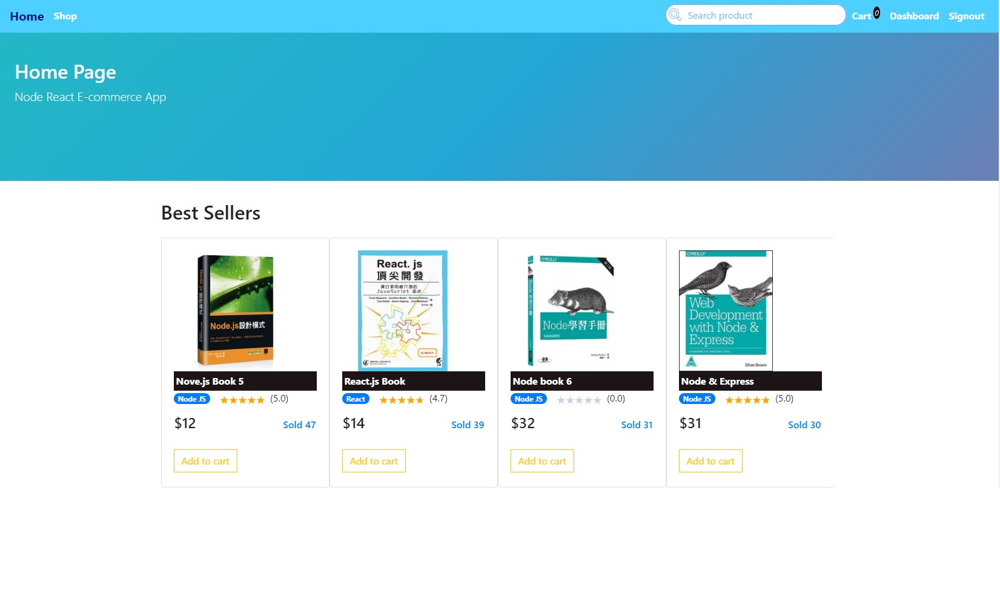
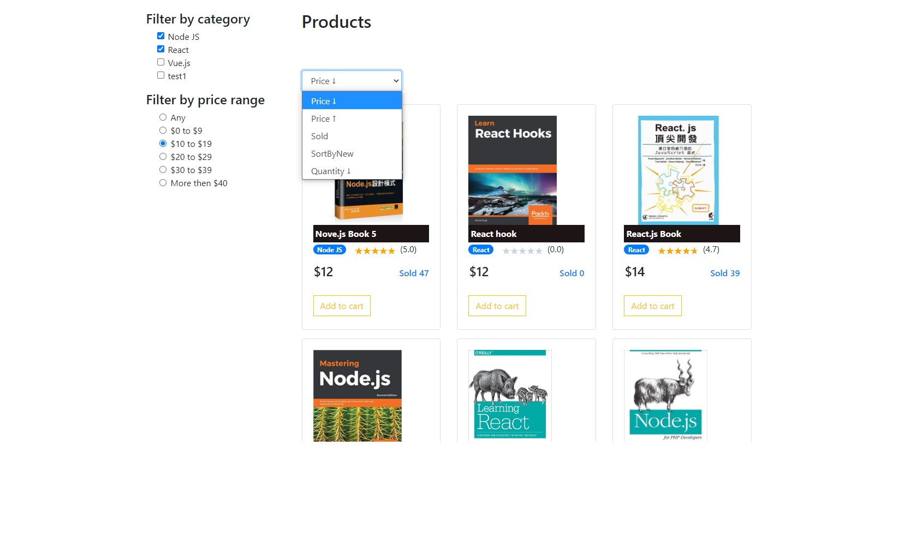
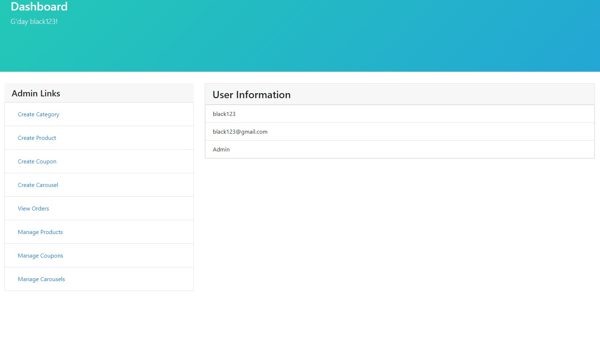
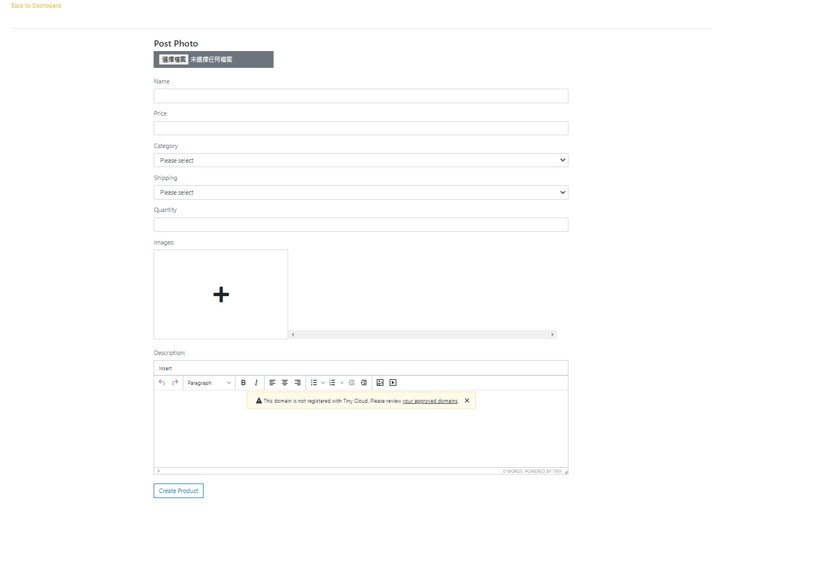
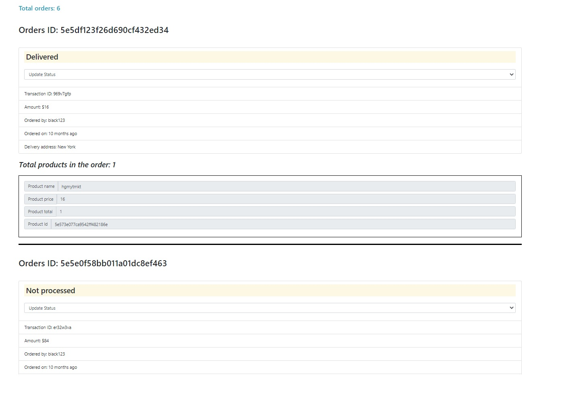

# MERN 購物網站
購物網站實作練習MERN_FullStack專案，使用 Restful Web API，涵蓋前後台，商品管理、分類、使用者等(CRUD)，登入/登出等功能。

## Demo
[Demo](https://mern-eco-frontend.herokuapp.com/)

## 後端程式碼
[node.js後端程式碼](https://github.com/Hankscr459/mern-ecommerce)

## 前台

## 後台

### 使用技術

- React Framework
- Bootstrap

### 使用插件

- Braintree-web-drop-in-react
- react-dropzone
- moment
- Tinymce-react
